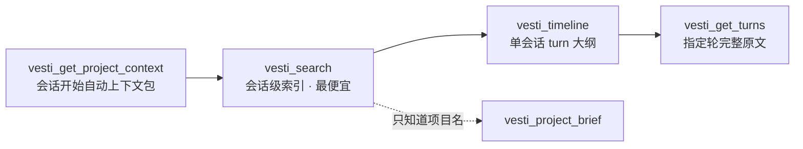

<div align="center">

# VESTI Skills

**让 AI coding agent 记得你做过的一切——并能把工作完整地交给下一个 agent。**

面向 kimi-code / Claude Code / Codex / Cursor 等 AI 编程工具的开源技能包，
由本地优先的 AI 对话记忆库 [VESTI](https://github.com/firefly-hefeng/VESTI-APP) 配套产出。

[](LICENSE)
[](skills/)
[](#安装)

</div>

---

## 为什么需要它

你的工程上下文散落在几十个会话、四五个工具里：

- 换了 agent / 开了新会话，就要把背景**重新交代一遍**；
- 上下文压缩（/compact）之后，「为什么这么做」的决策理由丢了；
- 跨项目合并、跨工具接力时，交接全凭复制粘贴和印象。

VESTI Skills 用两个互补的技能解决这个问题：一个负责**召回**（vesti-memory），一个负责**交接**（vesti-handoff）。

## 技能清单

| 技能 | 一句话 | 典型场景 |
|---|---|---|
| [**vesti-memory**](skills/vesti-memory/SKILL.md) | 三层渐进披露地检索 VESTI 采集的历史会话记忆 | 「继续上次…」续作、回查「当时为什么这样定」、会话开始自动拉项目上下文、跨项目合并前对齐状态 |
| [**vesti-handoff**](skills/vesti-handoff/SKILL.md) | 生成 schema 化的结构化交接包，内置「接手先验证」规则 | /compact 前压缩上下文、跨 agent 接力（kimi → Claude）、把任务交给下一个会话 |

### vesti-memory：先给索引，再给全文

不一次倾倒全部历史，而是每层便宜一个数量级，agent 自助按需深入：



- 会话开始时**自动拉项目上下文**（状态卡 / 活跃文件 / 未决问题），不再向用户重复索要背景；
- 多项目路径一次传入即可得到 `cross_project` 分析（共享文件、共享主题、时间交叠），直接支撑「基于几个分支开合并项目」；
- `confidence:"low"` 的结果只作线索不当事实——记忆不可靠时明确说不知道。

> vesti-memory 依赖本机运行 VESTI 并注册 vesti-mcp（只读 MCP server），
> 见 [VESTI-APP / packages/vesti-mcp](https://github.com/firefly-hefeng/VESTI-APP/tree/main/packages/vesti-mcp)。

### vesti-handoff：交接包即契约

```json
{
  "goal": "可检验的目标",
  "state": { "completed": [], "inProgress": [], "blocked": [] },
  "files": [{ "path": "...", "why": "...", "last_state": "..." }],
  "failedPaths": [{ "approach": "...", "whyFailed": "...", "evidence": "..." }],
  "verification": { "lastCommand": "...", "lastResult": "...", "passed": true },
  "nextSteps": ["按优先级排序"]
}
```

- **清单类信息（文件 / 命令 / git 状态）从真实记录提取，不凭印象罗列**；
- 核心规则「**接手先验证**」：接收方必须先复跑 `verification.lastCommand`，确认结果再信任交接包——死路和失败证据一并移交，不重复踩坑；
- 独立可用，不依赖 VESTI；V2 格式与 VESTI-APP 的 Relay Pack schema 对齐，可直接被应用端消费。

## 安装

```bash
git clone https://github.com/firefly-hefeng/VESTI-SKILLS.git
```

| Agent | 用户级安装 | 项目级安装 |
|---|---|---|
| **kimi-code** | `cp -r skills/<name> ~/.kimi-code/skills/` | `.kimi-code/skills/` |
| **Claude Code** | `cp -r skills/<name> ~/.claude/skills/` | `.claude/skills/` |
| **其他 agent** | 按其 skills/prompt 约定引入 `SKILL.md` 全文即可 | 同左 |

## 相关项目

- [**VESTI-APP**](https://github.com/firefly-hefeng/VESTI-APP) — 本地优先的桌面端：采集、整理、检索、接力你与各平台 AI 的全部对话
- [**VESTI 浏览器扩展**](https://github.com/firefly-hefeng/VESTI) — 网页端 AI 对话（Kimi / DeepSeek / ChatGPT / Claude / Gemini…）一键导入本地

## License

[MIT](LICENSE)
