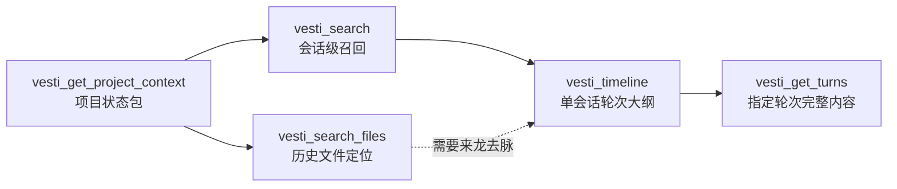
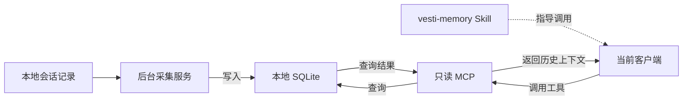

<div align="center">

# VESTI Skills

**让本地会话记忆在 Codex、Claude Code、Kimi Code、Cursor、Qoder、WorkBuddy 和 Trae 之间持续复用。**

VESTI 是一套跨 Agent 的本地记忆工具。它在后台整理已有的会话记录，
让当前使用的编程助手能查到之前的讨论、决策和相关文件，接着往下做。
采集服务、MCP 和 Skill 可以独立安装和运行。

[](LICENSE)
[](https://github.com/firefly-hefeng/VESTI-SKILLS/actions/workflows/ci.yml)
[](#支持的客户端)

</div>

---

## 它解决什么问题

同一个项目经常会在多个会话、多个编程助手之间推进。换工具或新开会话之后，项目背景、
已经尝试过的方案、文件位置和决策理由往往需要重新说明。

VESTI 把这些分散在本机的历史会话整理成一份共享记忆。安装完成后，支持的客户端可以通过
同一套 MCP 工具检索历史，`vesti-memory` Skill 则指导客户端先查索引、再按需读取原文，
避免一次塞入大量无关上下文。

你可以用它：

- 换一个 Agent 继续同一项目，查清之前确定的方案和未完成的工作。
- 新开会话时复用已有背景，减少反复复制历史对话。
- 根据讨论中的线索定位文件，核对当时为什么这样修改。
- 查找过去用过的信息和约定，并回到原始会话确认。

[开始安装](#快速开始) · [首次使用与验收](#首次使用与验收) · [支持的客户端](#支持的客户端) · [工作原理](#工作原理)

## 快速开始

当前使用源码安装。`@vesti/memory` 的 npm 发布方式暂不作为安装入口。
准备好 Git、Node.js 22.12 或更高版本，以及 Corepack；仓库固定使用 pnpm 10.34.4。

### 从源码安装

```bash
git clone --branch main --single-branch https://github.com/firefly-hefeng/VESTI-SKILLS.git
cd VESTI-SKILLS

corepack enable
corepack pnpm install --frozen-lockfile
corepack pnpm build

node packages/vesti-memory/dist/cli.js setup
```

`setup` 会自动检测已有的受支持客户端，安装 Skill、注册 MCP，并启动后台采集。
只想配置一个客户端时，可将最后一条命令改为：

```bash
node packages/vesti-memory/dist/cli.js setup --host codex
```

其他客户端的 `--host` 值见[支持的客户端](#支持的客户端)。这个参数只决定写入哪个客户端的配置，
不限制后台采集的会话来源。

`setup` 可重复执行，只新增或更新 VESTI 的配置项；修改已有配置前会创建备份，并保留其他 MCP 配置。
完成后重启或重新加载对应客户端，再按下一节检查是否可用。

安装器会把当前仓库中构建产物的绝对路径写入客户端配置，请把仓库放在长期保留的目录。移动目录或更新 Skill 后，重新运行 `setup`，再重启或重新加载客户端。
源码更新后先重新执行 `corepack pnpm build`。不要用一次性的 `npx` 缓存路径保存长期配置。

### 让 Agent 安装配套环境

也可以把下面这段话发给当前 coding agent，并授权它执行安装命令：

```text
请按 https://github.com/firefly-hefeng/VESTI-SKILLS 的 main 分支 README 安装 VESTI。把仓库克隆到长期保留的目录，检查 Node.js 版本，使用固定版本的 pnpm 安装依赖并构建，然后为当前客户端执行 setup、status 和 doctor。保留已有的其他 MCP 配置，完成后告诉我是否需要重启客户端。
```

English version:

```text
Install VESTI following the README on the main branch of https://github.com/firefly-hefeng/VESTI-SKILLS. Clone into a permanent directory, check Node.js, install and build with the pinned pnpm version, then run setup for this client, status and doctor. Preserve other MCP settings and tell me whether a client restart is needed.
```

## 首次使用与验收

### 1. 检查安装与采集状态

在仓库根目录执行：

```bash
node packages/vesti-memory/dist/cli.js status
node packages/vesti-memory/dist/cli.js sync
node packages/vesti-memory/dist/cli.js doctor
```

检查以下结果：

| 检查项 | 应看到什么 |
| --- | --- |
| 目标客户端 | `status` 中对应客户端显示 `Skill=ready, MCP=ready` |
| 数据库 | `Database:` 后有实际路径，而不是 `missing` |
| 采集服务 | 状态包含 `state: running`、`initialSyncComplete: true`（实际输出为 JSON） |
| 安装诊断 | `doctor` 的检查项为 `PASS`，最后显示 `VESTI memory is ready.`，退出码为 0 |

只需检查你打算使用的客户端；未安装、未配置的其他客户端显示 `missing` 不代表本次安装失败。
`doctor` 至少要求一个客户端配置完整，不能替代逐个客户端的验收。
采集服务就绪也不代表所有来源均无错误：还要检查同步结果和 `~/.vesti/logs/capture-daemon.log`。
首次同步可能需要等待历史记录导入。

### 2. 在客户端确认能够召回

重启或重新加载客户端，确认它能看到 VESTI MCP 工具和 `vesti-memory` Skill。
选一段你确实讨论过、且保存在受支持本地来源中的记录，把下面的主题替换成自己的内容：

```text
请使用 vesti-memory 查找我之前关于“登录模块”的讨论。
告诉我当时确定了什么、涉及哪些文件，并给出原始会话来源。先不要修改文件。
```

在工具调用记录中确认客户端实际调用了 VESTI 的检索工具，再核对回答中的会话来源和内容。
能够返回匹配的原始讨论，才说明这次历史召回验证通过；仅仅回答“已安装”不算。

如果没有结果，先检查来源是否有可读记录、同步是否报错，再换用原讨论中的具体关键词。
配置显示 `ready`，并不保证每个查询都一定命中。

<details>
<summary>已有 MCP 环境，只安装 Skill</summary>

远程默认分支也提供插件清单。以下入口安装 Skill，不替代上面的独立采集服务和 MCP 安装；`vesti-handoff` 可独立使用，`vesti-memory` 需要配套 MCP 提供历史检索。

**Kimi Code**（仓库根目录 `kimi.plugin.json`）：

```text
/plugins install https://github.com/firefly-hefeng/VESTI-SKILLS
```

安装后运行 `/reload` 或新开会话，也可用 `/skill:vesti-memory` 或 `/skill:vesti-handoff` 调用。

**Claude Code**（`.claude-plugin/marketplace.json`）：

```text
/plugin marketplace add firefly-hefeng/VESTI-SKILLS
/plugin install vesti-skills@vesti-skills
```

其他客户端也可手动把 `skills/vesti-memory` 和 `skills/vesti-handoff` 复制到各自的用户级 Skill 目录，然后重新加载客户端。若已经通过 `setup` 安装 `vesti-memory`，无需再重复安装同一 Skill。

</details>

## 支持的客户端

安装器支持 Codex、Claude Code、Kimi Code、Cursor、Qoder、WorkBuddy 和 Trae 系列，
后台默认检查这 7 类本地会话来源。Trae 仅支持旧版可读的 `state.vscdb`，不支持新版加密的
`ModularData/ai-agent/database.db`。

下表命令是 CLI 子命令；源码安装时请在前面加上 `node packages/vesti-memory/dist/cli.js`。

<details>
<summary>查看各客户端的配置路径与命令</summary>

| 客户端 | 用户级 Skill 位置 | 用户级 MCP 配置 | 单独配置命令 |
|---|---|---|---|
| Codex | `~/.agents/skills/vesti-memory/` | `~/.codex/config.toml` 的 `[mcp_servers.vesti]` | `setup --host codex` |
| Claude Code | `~/.claude/skills/vesti-memory/` | `~/.claude.json` 的 `mcpServers.vesti` | `setup --host claude` |
| Kimi Code | `~/.kimi-code/skills/vesti-memory/` | `~/.kimi-code/mcp.json` 的 `mcpServers.vesti` | `setup --host kimi-code` |
| Cursor | `~/.cursor/skills/vesti-memory/` | `~/.cursor/mcp.json` 的 `mcpServers.vesti` | `setup --host cursor` |
| Qoder 桌面版 | `~/.qoder/skills/vesti-memory/` | `<用户数据根>/Qoder/SharedClientCache/mcp.json` | `setup --host qoder` |
| Qoder CLI | `~/.qoder/skills/vesti-memory/` | `~/.qoder/settings.json` 的 `mcpServers.vesti` | `setup --host qoder-cli` |
| WorkBuddy | `~/.workbuddy/skills/vesti-memory/` | `~/.workbuddy/mcp.json` 的 `mcpServers.vesti` | `setup --host workbuddy` |
| Trae | `~/.trae/skills/vesti-memory/` | `<用户数据根>/Trae/User/mcp.json` | `setup --host trae` |
| Trae CN | `~/.trae-cn/skills/vesti-memory/` | `<用户数据根>/Trae CN/User/mcp.json` | `setup --host trae-cn` |
| TRAE SOLO CN | `~/.trae-cn/skills/vesti-memory/` | `<用户数据根>/TRAE SOLO CN/User/mcp.json` | `setup --host trae-solo-cn` |

用户数据根在 Windows 为 `%APPDATA%`，macOS 为 `~/Library/Application Support`，Linux 为 `$XDG_CONFIG_HOME`（默认 `~/.config`）。Qoder 桌面版与 CLI 的 MCP 路径不同；安装器按实际存在的用户配置目录识别，不要求用户手填 JSON。Qoder CLI 使用默认 `~/.qoder` 布局，暂不处理 `QODER_CONFIG_DIR` 自定义布局。

不带 `--host` 等同于 `--host all`：只配置在当前用户目录中检测到的客户端。即使未被自动检测，
也可以通过显式 `--host` 完成配置。

</details>

## 如何召回记忆

安装后可以直接在任一受支持的客户端中描述任务，例如：

```text
继续我昨天在登录模块里的工作，先找出改过的文件和还没解决的问题。
```

配套 Skill 会根据问题逐层使用 MCP，而不是一次读取全部历史：



常用能力包括：

- 根据主题、项目和时间范围查找历史会话；
- 定位历史工作涉及的文件，并保留支撑结果的会话证据；
- 查看单个会话的大纲，再读取必要轮次的用户问题、过程信息和最终答复；
- 读取数据库中已有的项目状态与未决问题，并从原始会话和工具记录提供活跃文件、跨项目线索；尚未生成的摘要层会为空；
- 查询 deposit、dream、note 等记忆空间内容。

历史文件结果只表示“这个路径曾在会话中出现”，不保证文件目前仍存在。Skill 会在可访问项目时
再读取磁盘上的当前文件；低置信度结果只作为线索，不会被表述成确定事实。

## 工作原理

后台采集服务读取受支持的本地会话记录，整理后写入同一份 SQLite 数据库。
当前客户端读取 Skill 指令，根据任务调用 MCP 工具；MCP 查询数据库并把结果返回客户端。
Skill 是调用规则，不是位于 MCP 和客户端之间的独立服务。



采集服务会先导入已有记录，再通过文件监听或轮询获取变化，并定期补扫。
每个目标数据库由一个独立后台进程串行写入；多个客户端可通过 MCP 读取它。
Skill 规定何时检索、如何逐层深入，以及如何处理低置信度结果，本身不采集数据或直接读取数据库。

`setup` 会为当前登录会话启动后台进程，不创建操作系统开机启动项；以后客户端启动 VESTI MCP 时，
也会检查并按需拉起采集服务。完整的进程、来源差异与降级行为见
[无 App 记忆运行时说明](docs/standalone-memory-runtime.md)。

## 包与 Skill

| 路径 | 包或 Skill | 职责 |
|---|---|---|
| [`packages/vesti-memory`](packages/vesti-memory/README.md) | `@vesti/memory` | 一体化安装与诊断 CLI；配置七类客户端及版本变体、安装 Skill、注册 MCP、管理 daemon |
| [`packages/vesti-capture-runtime`](packages/vesti-capture-runtime/README.md) | `@vesti/capture-runtime` | 无界面的本地采集引擎、单写者 daemon 和轻量 IPC client |
| [`packages/vesti-mcp`](packages/vesti-mcp/README.md) | `@vesti/mcp` | 只读 stdio MCP server，提供会话、项目、记忆空间与文件检索工具 |
| [`packages/vesti-memory-core`](packages/vesti-memory-core/README.md) | `@vesti/memory-core` | 可复用的 SQLite schema、迁移、记忆整理和检索原语 |
| [`packages/vesti-search-files-core`](packages/vesti-search-files-core/README.md) | `@vesti/search-files-core` | 不依赖数据库或 MCP 的确定性历史文件定位核心 |
| [`skills/vesti-memory`](skills/vesti-memory/SKILL.md) | `vesti-memory` | 指导客户端通过 MCP 渐进召回会话、项目和文件记忆 |
| [`skills/vesti-handoff`](skills/vesti-handoff/SKILL.md) | `vesti-handoff` | 生成可验证的结构化交接包，可独立于 VESTI 使用 |

## 仓库结构

```text
VESTI-SKILLS/
├── skills/
│   ├── vesti-memory/              # MCP 记忆召回策略
│   └── vesti-handoff/             # 跨会话结构化交接
├── packages/
│   ├── vesti-memory/              # setup / status / sync / doctor CLI
│   ├── vesti-capture-runtime/     # 独立采集 daemon 与 IPC client
│   ├── vesti-mcp/                 # 只读 stdio MCP server
│   ├── vesti-memory-core/         # SQLite 记忆核心
│   └── vesti-search-files-core/   # 历史文件定位核心
├── examples/                      # 核心包端到端示例
└── benchmarks/                    # 文件检索评测与审计材料
```

## 数据目录与环境变量

默认数据布局：

```text
~/.vesti/
├── db/vesti.db
├── vault/
├── logs/capture-daemon.log
└── runtime/
```

- `VESTI_HOME`：移动整套 VESTI 数据目录。
- `VESTI_DB_PATH`：只覆盖 SQLite 数据库路径。
- `VESTI_CAPTURE_DISABLED=1`：仅在明确需要查询静态数据库快照时禁用自动采集。

## 可选集成

[VESTI-APP](https://github.com/221250144/VESTI-APP) 提供可选的桌面浏览与管理体验。
本仓库的采集、MCP 和 Skill 不依赖 App。若要让 App 查看同一数据库，
不要同时启用 App 的旧捕获器和独立采集服务写入该库。

另有 [VESTI 浏览器扩展](https://github.com/221250144/VESTI)，用于导入网页端对话。

## License

[MIT](LICENSE)
