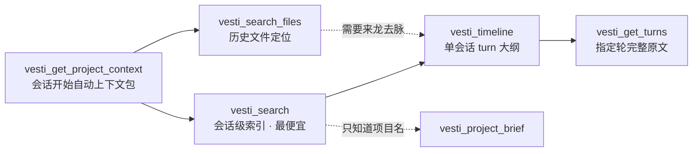

<div align="center">

# VESTI Skills

**让 AI coding agent 记得你做过的一切——并能把工作完整地交给下一个 agent。**

面向 kimi-code / Claude Code / Codex / Cursor 等 AI 编程工具的开源技能包，
由本地优先的 AI 对话记忆库 [VESTI](https://github.com/221250144/VESTI-APP) 配套产出。

[](LICENSE)
[](https://github.com/firefly-hefeng/VESTI-SKILLS/actions/workflows/ci.yml)
[](skills/)
[](#安装)

</div>

---

## 为什么需要它

你的工程上下文散落在几十个会话、四五个工具里：

- 换了 agent / 开了新会话，就要把背景**重新交代一遍**；
- 上下文压缩（/compact）之后，「为什么这么做」的决策理由丢了；
- 跨项目合并、跨工具接力时，交接全凭复制粘贴和印象。

VESTI Skills 用两个互补的技能解决这个问题：一个负责**召回**（vesti-memory），一个负责**交接**（vesti-handoff）。

## 技能清单

| 技能 | 一句话 | 典型场景 |
|---|---|---|
| [**vesti-memory**](skills/vesti-memory/SKILL.md) | 从项目、文件、会话到指定轮次渐进检索 VESTI 记忆 | 「继续上次…」续作、定位历史工作涉及的文件、回查决策原因、跨项目合并前对齐状态 |
| [**vesti-handoff**](skills/vesti-handoff/SKILL.md) | 生成 schema 化的结构化交接包，内置「接手先验证」规则 | /compact 前压缩上下文、跨 agent 接力（kimi → Claude）、把任务交给下一个会话 |

### vesti-memory：先给索引，再给全文

不一次倾倒全部历史，而是每层便宜一个数量级，agent 自助按需深入：



- skill 指引 Agent 在会话开始时**主动拉取项目上下文**（状态卡 / 活跃文件 / 未决问题），不再向用户重复索要背景；
- 文件类问题通过 `vesti_search_files` 直接得到路径、项目、最近触碰时间和支撑会话；Agent 再读取磁盘上的当前文件，避免把历史路径误当成最新内容；
- 多项目路径一次传入即可得到 `cross_project` 分析（共享文件、共享主题、时间交叠），直接支撑「基于几个分支开合并项目」；
- `confidence:"low"` 的结果只作线索不当事实——记忆不可靠时明确说不知道。

> vesti-memory 依赖本机运行 VESTI 并注册 vesti-mcp。文件定位算法由本仓库的
> [`@vesti/search-files-core`](packages/vesti-search-files-core) 维护；VESTI-APP 侧保留数据库适配和 MCP 协议入口。

### 文件定位核心

[`@vesti/search-files-core`](packages/vesti-search-files-core/README.md) 是 `vesti_search_files` 的可复用 TypeScript 核心。它通过同步 `FileSearchDataSource` 接收会话召回、摘要关键文件和工具输入，负责路径提取、历史证据聚合以及确定性评分与排序。核心包本身不直接访问 SQLite、文件系统或网络，也不依赖 Electron/MCP。

它只返回历史会话中出现过的文件证据，不读取当前磁盘，也不会把历史路径宣称为当前仍然存在。VESTI-APP 继续拥有数据库查询和 MCP 协议适配，因此现有 `vesti_search_files` 工具名和调用方式不变。

> **发布状态：** VESTI-APP 目前通过 `package.json` 的 `link:` 协议与本包本地联调，因此两个仓库暂时需要位于同一级目录。包发布到 npm 后，APP 将改为精确版本号（例如 `0.1.0`，不使用 `^` 或 `~`），届时不再依赖本地目录结构。

开发环境要求 Node.js 22.12 或更高版本，并通过 Corepack 使用 pnpm 10.34.4：

```bash
corepack pnpm install --frozen-lockfile
corepack pnpm typecheck
corepack pnpm test
corepack pnpm build
```

包的 API、边界和独立开发命令见[核心包 README](packages/vesti-search-files-core/README.md)。

### 记忆核心与 MCP server

另外两个包把 VESTI 的底层记忆机制整体抽成了可独立使用的模块：

- [`@vesti/memory-core`](packages/vesti-memory-core/README.md) — 记忆存储与整理核心：SQLite schema 与 15 个迁移、会话/消息存储、L0–L2 项目记忆（状态卡 / 活跃文件时间线 / 维护式简报）、记忆空间（deposit / dream / note）、会话 digest 管线与三层检索原语（FTS5 召回、向量检索、语义边）。LLM 与 embedding 都是注入接口，包本身无网络与模型 SDK 依赖，仅依赖 better-sqlite3。
- [`@vesti/mcp`](packages/vesti-mcp/README.md) — 把 VESTI 记忆库暴露给任意 MCP 客户端的 server（即 skills 里 vesti-mcp 的独立发布形态）：`vesti_search` / `vesti_timeline` / `vesti_get_turns` / `vesti_get_project_context` / `vesti_search_files` / `vesti_memory_*` 等 9 个工具，除 digest 访问计数外严格只读。

可运行的端到端示例见 [`examples/`](examples/README.md)（建库 → 写入 → digest → 召回）。

### vesti-handoff：交接包即契约

```json
{
  "goal": "可检验的目标",
  "state": { "completed": [], "inProgress": [], "blocked": [] },
  "files": [{ "path": "...", "why": "...", "last_state": "..." }],
  "failedPaths": [{ "approach": "...", "whyFailed": "...", "evidence": "..." }],
  "verification": { "lastCommand": "...", "lastResult": "...", "passed": true },
  "nextSteps": ["按优先级排序"]
}
```

- **清单类信息（文件 / 命令 / git 状态）从真实记录提取，不凭印象罗列**；
- 核心规则「**接手先验证**」：接收方必须先复跑 `verification.lastCommand`，确认结果再信任交接包——死路和失败证据一并移交，不重复踩坑；
- 独立可用，不依赖 VESTI；V2 格式与 VESTI-APP 的 Relay Pack schema 对齐，可直接被应用端消费。

## 仓库结构

```text
VESTI-SKILLS/
├── skills/
│   ├── vesti-memory/              # 历史会话与文件记忆召回
│   └── vesti-handoff/             # 跨会话、跨 Agent 结构化交接
├── packages/
│   ├── vesti-search-files-core/   # 可复用的纯 TypeScript 文件定位核心
│   ├── vesti-memory-core/         # 记忆存储、digest 管线与检索核心
│   └── vesti-mcp/                 # 暴露 VESTI 记忆库的 MCP server
└── examples/                      # 核心库可运行示例
```

## 安装

### 方式一：直接从 GitHub 安装（推荐，无需 clone）

**Kimi Code**（插件机制，一条命令；仓库根部的 `kimi.plugin.json` 即插件清单）：

```text
/plugins install https://github.com/firefly-hefeng/VESTI-SKILLS
```

装完运行 `/reload`（或开新会话）生效，之后可自动触发，也可 `/skill:vesti-memory` / `/skill:vesti-handoff` 手动调用。

**Claude Code**（插件市场机制；`.claude-plugin/marketplace.json` 即市场清单）：

```text
/plugin marketplace add firefly-hefeng/VESTI-SKILLS
/plugin install vesti-skills@vesti-skills
```

### 方式二：手动拷贝（所有 agent 通用）

```bash
git clone https://github.com/firefly-hefeng/VESTI-SKILLS.git
```

| Agent | 用户级安装 | 项目级安装 |
|---|---|---|
| **kimi-code** | `cp -r skills/<name> ~/.kimi-code/skills/` | `.kimi-code/skills/` |
| **Claude Code** | `cp -r skills/<name> ~/.claude/skills/` | `.claude/skills/` |
| **其他 agent** | 按其 skills/prompt 约定引入 `SKILL.md` 全文即可 | 同左 |

> 依赖说明：`vesti-handoff` 独立可用；`vesti-memory` 需要本机运行 VESTI 桌面端（或独立部署 `@vesti/mcp`）提供 MCP 检索工具。

## 相关项目

- [**VESTI-APP**](https://github.com/221250144/VESTI-APP) — 本地优先的桌面端：采集、整理、检索和接力受支持平台的本地 AI 对话
- [**VESTI 浏览器扩展**](https://github.com/221250144/VESTI) — 网页端 AI 对话（Kimi / DeepSeek / ChatGPT / Claude / Gemini…）一键导入本地

## License

[MIT](LICENSE)
