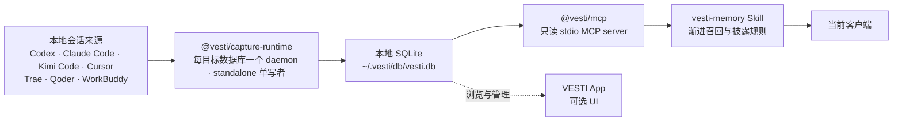
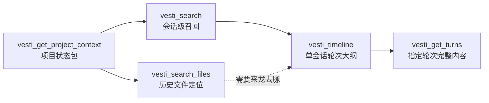

<div align="center">

# VESTI Skills

**让本地会话记忆在 Codex、Claude Code、Kimi Code 和 Cursor 之间持续复用。**

VESTI 提供一套可独立运行的本地记忆链路：后台采集会话，统一写入 SQLite，
再通过只读 MCP 工具和 Skill 把需要的上下文交给当前使用的编程助手。
VESTI App 是可选的可视化界面，不是采集、检索或使用 Skill 的前置条件。

[](LICENSE)
[](https://github.com/firefly-hefeng/VESTI-SKILLS/actions/workflows/ci.yml)
[](#支持的客户端)

</div>

---

## 它解决什么问题

同一个项目经常会在多个会话、多个编程助手之间推进。换工具或新开会话之后，项目背景、
已经尝试过的方案、文件位置和决策理由往往需要重新说明。

VESTI 把这些分散在本机的历史会话整理成一份共享记忆。安装完成后，支持的客户端可以通过
同一套 MCP 工具检索历史，`vesti-memory` Skill 则指导客户端先查索引、再按需读取原文，
避免一次塞入大量无关上下文。

## 当前架构



- `@vesti/capture-runtime` 负责发现本地会话来源、首次增量同步、文件变化监听和定期补偿扫描；每个目标数据库由一个 standalone daemon 串行写入。
- SQLite 是默认的本地事实源。数据库、原始记录备份和运行日志默认位于 `~/.vesti/`。
- `@vesti/mcp` 以 stdio 方式向客户端提供检索工具，并以只读方式访问数据库；启动 MCP 时会连接或拉起采集 daemon。
- `vesti-memory` Skill 规定何时检索、如何逐层深入，以及如何处理低置信度结果。Skill 本身不采集数据，也不直接读取数据库。
- VESTI App 只是一种可选的图形界面。没有安装或没有打开 App 时，独立 runtime、MCP 和 Skill 仍可完成实时采集与召回。

`setup` 不会安装操作系统开机启动项。它会为当前登录会话启动后台 daemon；以后客户端启动
VESTI MCP 时也会再次确认 daemon 已运行。

当前安装器可自动写入 Codex、Claude Code、Kimi Code 和 Cursor 的 Skill/MCP 配置；
独立采集 runtime 还会读取 Trae、Qoder 和 WorkBuddy 的本地会话记录。Trae 当前只读取旧版可解析的 `state.vscdb`；新版加密 `ModularData/ai-agent/database.db` 不在支持范围内。

完整的进程、数据路径、降级和安全边界见
[无 App 记忆运行时说明](docs/standalone-memory-runtime.md)。

## 快速开始

要求 Node.js 22.12 或更高版本。

### npm 发布后的推荐安装方式

> `@vesti/memory` 目前仍在本仓库中开发。下面是包发布到 npm 后的目标命令，
> 不代表该包现在已经可以从 npm 下载；发布前请使用下一节的源码方式。

```bash
# 全局安装可为宿主配置保留一个稳定的 MCP 入口路径
npm install -g @vesti/memory

# 自动检测已安装的受支持客户端，安装 Skill、注册 MCP 并启动采集
vesti setup

# 查看客户端配置、数据库和采集 daemon 状态
vesti status

# 立即要求 daemon 扫描本地会话来源
vesti sync

# 检查 Node.js、Skill、MCP、数据库和 daemon 是否可用
vesti doctor
```

也可以只配置一个客户端；`--host` 只决定写入哪个宿主的 Skill/MCP 配置，不改变 daemon 扫描的会话来源：

```bash
vesti setup --host codex
vesti setup --host claude
vesti setup --host kimi-code
vesti setup --host cursor
```

`setup` 可重复执行。它只新增或更新 VESTI 自己的配置项，保留其他 MCP 配置；修改已有配置前会创建备份。
不要从一次性的 `npx` 缓存执行持久化 setup；缓存清理后，宿主配置中记录的入口路径会失效。
配置完成后请重启或重新加载对应客户端，使新的 Skill 和 MCP 配置生效。

### npm 发布前从源码运行

```bash
git clone --branch feat/standalone-memory-runtime --single-branch https://github.com/firefly-hefeng/VESTI-SKILLS.git
cd VESTI-SKILLS

corepack enable
corepack pnpm install --frozen-lockfile
corepack pnpm build

node packages/vesti-memory/dist/cli.js setup
node packages/vesti-memory/dist/cli.js status
node packages/vesti-memory/dist/cli.js sync
node packages/vesti-memory/dist/cli.js doctor
```

仓库固定使用 pnpm 10.34.4。以上命令明确拉取独立运行版本所在分支；在该分支合并前，默认分支不包含完整安装链路。源码发生变化后，请重新执行 `corepack pnpm build` 再运行 CLI。

安装器会把当前仓库中构建产物的绝对路径写入客户端配置，请把仓库放在长期保留的目录。移动目录或更新 Skill 后，重新运行 `setup`，再重启或重新加载客户端。

## 支持的客户端

`@vesti/memory` 会按每个客户端的真实格式注册同一个只读 stdio MCP，并安装配套 Skill：

| 客户端 | 用户级 Skill 位置 | 用户级 MCP 配置 | 单独配置命令 |
|---|---|---|---|
| Codex | `~/.agents/skills/vesti-memory/` | `~/.codex/config.toml` 的 `[mcp_servers.vesti]` | `setup --host codex` |
| Claude Code | `~/.claude/skills/vesti-memory/` | `~/.claude.json` 的 `mcpServers.vesti` | `setup --host claude` |
| Kimi Code | `~/.kimi-code/skills/vesti-memory/` | `~/.kimi-code/mcp.json` 的 `mcpServers.vesti` | `setup --host kimi-code` |
| Cursor | `~/.cursor/skills/vesti-memory/` | `~/.cursor/mcp.json` 的 `mcpServers.vesti` | `setup --host cursor` |

不带 `--host` 等同于 `--host all`：只配置在当前用户目录中检测到的客户端。即使未被自动检测，
也可以通过显式 `--host` 完成配置。

## 如何召回记忆

安装后可以直接在任一受支持的客户端中描述任务，例如：

```text
继续我昨天在登录模块里的工作，先找出改过的文件和还没解决的问题。
```

配套 Skill 会根据问题逐层使用 MCP，而不是一次读取全部历史：



常用能力包括：

- 根据主题、项目和时间范围查找历史会话；
- 定位历史工作涉及的文件，并保留支撑结果的会话证据；
- 查看单个会话的大纲，再读取必要轮次的用户问题、过程信息和最终答复；
- 读取数据库中已有的项目状态与未决问题，并从原始会话和工具记录提供活跃文件、跨项目线索；尚未生成的摘要层会为空；
- 查询 deposit、dream、note 等记忆空间内容。

历史文件结果只表示“这个路径曾在会话中出现”，不保证文件目前仍存在。Skill 会在可访问项目时
再读取磁盘上的当前文件；低置信度结果只作为线索，不会被表述成确定事实。

## 包与 Skill

| 路径 | 包或 Skill | 职责 |
|---|---|---|
| [`packages/vesti-memory`](packages/vesti-memory/README.md) | `@vesti/memory` | 一体化安装与诊断 CLI；配置四个客户端、安装 Skill、注册 MCP、管理 daemon |
| [`packages/vesti-capture-runtime`](packages/vesti-capture-runtime/README.md) | `@vesti/capture-runtime` | 无界面的本地采集引擎、单写者 daemon 和轻量 IPC client |
| [`packages/vesti-mcp`](packages/vesti-mcp/README.md) | `@vesti/mcp` | 只读 stdio MCP server，提供会话、项目、记忆空间与文件检索工具 |
| [`packages/vesti-memory-core`](packages/vesti-memory-core/README.md) | `@vesti/memory-core` | 可复用的 SQLite schema、迁移、记忆整理和检索原语 |
| [`packages/vesti-search-files-core`](packages/vesti-search-files-core/README.md) | `@vesti/search-files-core` | 不依赖数据库或 MCP 的确定性历史文件定位核心 |
| [`skills/vesti-memory`](skills/vesti-memory/SKILL.md) | `vesti-memory` | 指导客户端通过 MCP 渐进召回会话、项目和文件记忆 |
| [`skills/vesti-handoff`](skills/vesti-handoff/SKILL.md) | `vesti-handoff` | 生成可验证的结构化交接包，可独立于 VESTI 使用 |

## 仓库结构

```text
VESTI-SKILLS/
├── skills/
│   ├── vesti-memory/              # MCP 记忆召回策略
│   └── vesti-handoff/             # 跨会话结构化交接
├── packages/
│   ├── vesti-memory/              # setup / status / sync / doctor CLI
│   ├── vesti-capture-runtime/     # 独立采集 daemon 与 IPC client
│   ├── vesti-mcp/                 # 只读 stdio MCP server
│   ├── vesti-memory-core/         # SQLite 记忆核心
│   └── vesti-search-files-core/   # 历史文件定位核心
├── examples/                      # 核心包端到端示例
└── benchmarks/                    # 文件检索评测与审计材料
```

## 数据目录与环境变量

默认数据布局：

```text
~/.vesti/
├── db/vesti.db
├── vault/
├── logs/capture-daemon.log
└── runtime/
```

- `VESTI_HOME`：移动整套 VESTI 数据目录。
- `VESTI_DB_PATH`：只覆盖 SQLite 数据库路径。
- `VESTI_CAPTURE_DISABLED=1`：仅在明确需要查询静态数据库快照时禁用自动采集。

## VESTI App

[VESTI-APP](https://github.com/221250144/VESTI-APP) 提供可选的桌面浏览与管理体验。
独立方案已经把实时采集和 MCP 从 App 生命周期中移出，因此：

- 只安装本仓库的 runtime、MCP 和 Skill，也可以持续采集并跨客户端召回；
- 安装 App 后可以查看同一份本地记忆，但无需为了保持采集而一直打开 App；在 App 的旧捕获器尚未改为复用 standalone daemon 前，不要让两套捕获器同时写同一个数据库；
- MCP 查询保持只读，数据写入统一交给 capture runtime。

另有 [VESTI 浏览器扩展](https://github.com/221250144/VESTI)，用于导入网页端对话。

## License

[MIT](LICENSE)
